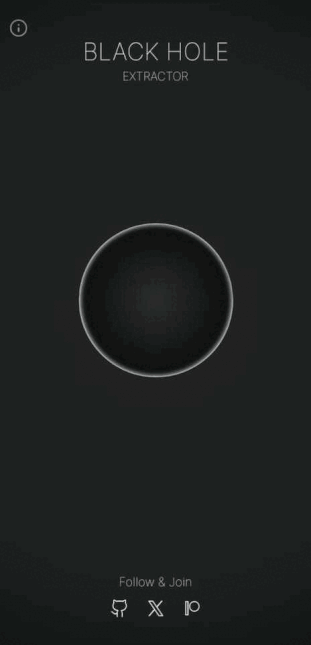

# 🚀 BlackHole++

**BlackHole++** is your (9 MB) lightweight go-to app for quick audio/video downloads from 40+ platforms, including **Facebook**, **Twitter**,, **TeraBox**, and **TikTok**. Simple, clean, and junk-free, it lets you save videos to your gallery with just **one click**!

---

## ✨ Key Features
- **Supports Major Platforms:** Download from social media and more.
- **Lightweight:** Just **9MB** for fast, smooth performance.
- **One-Tap Downloads:** Copy or share a link—BlackHole++ handles the rest.
- **Open Source:** Free to use, modify, and improve.
- **No Ads:** Enjoy a clean, ad-free experience.
---

## 🔑 How to Get Your API Key
To use BlackHole++, you need a RapidAPI key for the Black Hole API. Follow these steps:

1. **Sign Up:** Create an account at [rapidapi.com](https://rapidapi.com).
2. **Find the API:** Search for "Social Download All In One" in the RapidAPI marketplace or visit [this link](https://rapidapi.com/nguyenmanhict-MuTUtGWD7K/api/social-download-all-in-one).
3. **Subscribe:** Choose the free plan to get started.
4. **Copy Your Key:** Navigate to the "Code Snippets" section and copy your API key.
5. **Enter in App:** Open BlackHole++, paste the key in the API key input field, and save it.

🎥 **Watch the Tutorial:**  
Check out this step-by-step video guide to get your API key:

---

## 💾 How to Use

### Copy & Paste Method:
1. Copy the link of the video you want to download.
2. Open **BlackHole++**.
3. Hit the big round button to start downloading immediately.

--- 

### Share-to-Download Method:
1. Tap the **share button** on any platform.
2. Select **BlackHole++** from the share menu.
3. The app will automatically grab the link and start downloading the video.

## 📸 Screenshots

---

## 🌟 Love It? Improve It!
This is an **open-source project**, so feel free to:
- Clone the repo
- Modify it
- Build on top of it

Let’s create something cool together!  
